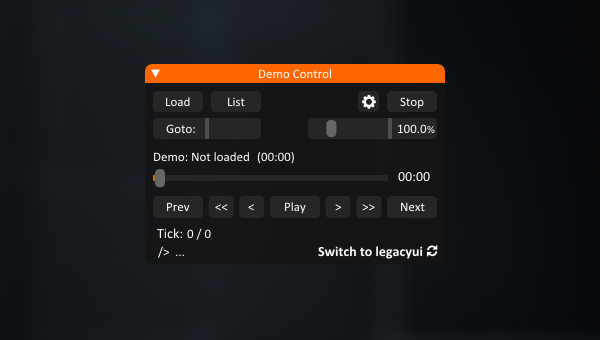

# p2ce-autosplitter
### p2ce-autosplitter is internal cheat-like program for strata source portal mods.

## **Currently supports:**
- **Portal Revolution**

- # [Installation](##Installation)

## **Starting a Speedrun:**
**You can use *Start Speedrun* button in main menu or *Restart Speedrun* in pause menu. You can also just type "reset" command in console**
**Please note that it requires "wakeup_save.sav" save to work properly. You can find it on speedrun.com game resources page.**

## Features:
- ### **Auto-Recording demos to separate run folder**
- ### **Auto-Splitting using local tcp server**
- ### **Brand new DemoControl ui replacement for obsolete demoui!**
|  |
|-|
**DemoControl also includes list feature!**
**You can open a folder which contents demos and iterating on them without worry!**
|  |
**"List" supports auto-switching to next demo once its done playing aswell**

### Usage:
**To toggle open the ui, you can press *RightShift* or use default *Shift+F2***
**To open a folder - go to *List* menu and click *Open*. Then you can iterate on loaded demos by double clicking on them or by using *Select***
- ### **Game ui changes:**
|  |  |
|-|-|

## Setting up LiveSplit:
**Open your LiveSplit and right click on it, Control -> Start TCP Server**
|-|
|  |

**Then go back to game and you will see *LiveSplit Connected* in upper right corner if it does (Reconnect without restarting the game is supported)**
## Installation:
- **Download and run Installer.exe from Releases(todo: add clickable link under the Releases button). Or download auto-launcher.dll and manually dragndrop it to your \bin\win64**
